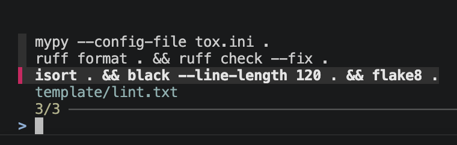

# bd

A tiny [fzf](https://github.com/junegunn/fzf) command launcher for macOS and Linux.



Edit `bd/template/` to add commands.
- `.txt` files are menus
- `.md` files are viewed
- `.py`, and `.sh` files are opened or executed
- folders contain files to copy.
- Commands run from the current directory. Symlinks are refused.

Menu commands run verbatim in your shell. Only use templates you trust.

## Install

```bash
brew install fzf
pip install -e .
```

## Use

```bash
bd           # opens menu in commands.txt
bd hello.py  # runs hello.py
bd git shortlog  # open git.txt -> runs git 'git shortlog -sn --no-merges'
```


## License

MIT
