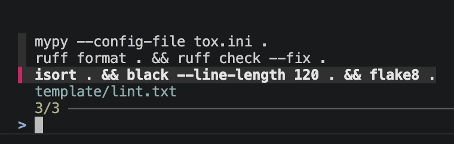

# bd

A tiny [fzf](https://github.com/junegunn/fzf) command launcher for macOS and Linux.



TL;DR: Put commonly used shell commands, scripts or often copied over files in the `bd/template/` directory, then run `bd`:
- `.txt` files are shown as menus of shell commands
- `.py`, and `.sh` files are executed directly
- Files inside folders can be copied over to the current directory (e.g. `AGENTS.md` or `.gitignore`)


## Install

```bash
brew install fzf
pip install -e .
```

## Use

```bash
bd           # opens menu in commands.txt
bd hello.py  # runs hello.py
bd git shortlog  # open git.txt -> runs git 'git shortlog -sn --no-merges'
```

## License

MIT
